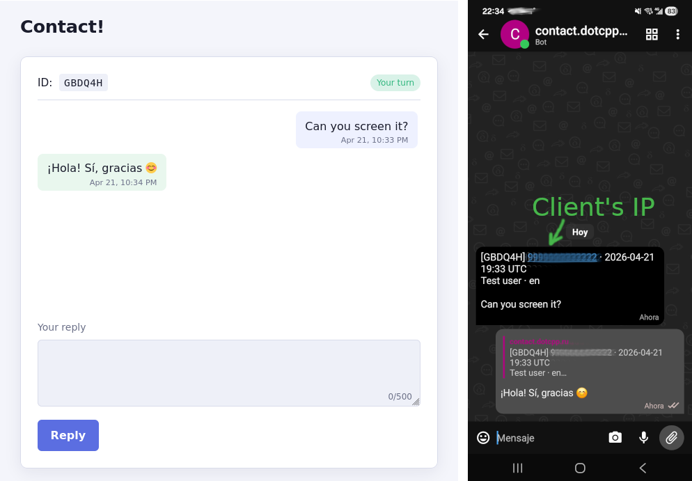

[Читать на Русском](README_ru.md)

# DeltaFeedback



Self-hosted contact form for a personal site. Visitors submit messages via
a tiny HTML form; messages reach you over Delta Chat, where you reply
through the standard DC "reply" feature. Replies appear on the visitor's
ticket page in real time.

- Single C++ binary, single SQLite file.
- POW captcha (SHA-256 hashcash, 18 bits default) + honeypot + form
  fill-time check.
- Per-locale welcome HTML, browser-language switcher (ru / en).
- One admin: the first contact to message the bot becomes admin; everyone
  else is silently blocked.
- Tickets are purged 7 days after the last activity (any side).
- Admin replies route via DC's quote/reply — no `[ID]` typing required;
  `[ID]` fallback still works for cross-device cases.

License: **GPLv3**.

## Dependencies

- C++17 toolchain (g++ or clang)
- CMake ≥ 3.16
- `libsqlite3-dev`, `libssl-dev`, `libasio-dev`
- `libdeltachat` from
  [deltachat-core-rust](https://github.com/chatmail/core), built ahead of
  time

CrowCpp 1.2.0 and gtest are fetched by CMake.

## Build

```bash
cmake -S . -B build
cmake --build build -j$(nproc)
ctest --test-dir build
```

`CMakeLists.txt` looks for `libdeltachat.so` under
`../deltachatbot-cpp/deltachat-core-rust/target/release/`. Override with
`-DDC_CORE=/path/to/deltachat-core-rust` if it lives elsewhere.

## Configure and run

```bash
cp config.example.ini config.ini
./build/deltafeedback --register <chatmail-domain> config.ini
./build/deltafeedback --run config.ini
```

`--register` creates a new chatmail account and writes credentials either
into the same config file (dev) or into the account file referenced by the
`account_path=` key (production — see the Debian package section).
`--run` starts the DC event loop and the HTTP server (default
`0.0.0.0:8080`). On the first run the bot prints a Delta Chat invite URL —
open it in your DC client to add the bot; your account becomes admin.

If `config` is omitted, `./config.ini` is used.

## Show invite URL

```bash
./build/deltafeedback --invite config.ini
```

Prints the current Delta Chat invite URL to stdout. Useful under systemd
where the service's stdout goes to journald, or after `--reset-admin`.

## Reset admin

```bash
./build/deltafeedback --reset-admin config.ini
```

Clears the owner contact id and removes all tickets and POW state. The
next contact to message the bot becomes the new admin.

## Behind a reverse proxy

Visitor IP is read from `X-Forwarded-For` (leftmost), then `X-Real-IP`,
falling back to the connecting peer. Bind to `127.0.0.1` in production and
let caddy/nginx terminate TLS.

## Debian package

Pre-built `.deb` artifacts for Debian 12 (bookworm) and 13 (trixie) are
produced by GitHub Actions on every push to `main` — see the workflow at
`.github/workflows/deb.yml`. Releases (tags `v*`) attach the artifacts to
the GitHub Release.

To build locally:

```bash
cmake -S . -B build && cmake --build build -j
./packaging/build-deb.sh   # writes dist/deltafeedback_<ver>_<codename>_<arch>.deb
```

The package installs:

| Path                                    | Purpose                                   |
|-----------------------------------------|-------------------------------------------|
| `/usr/bin/deltafeedback`                | binary                                    |
| `/usr/lib/deltafeedback/libdeltachat.so`| bundled DC core (rpath wired)             |
| `/usr/share/deltafeedback/web/`         | frontend assets — **overwritten** on upgrade EXCEPT `welcome.{ru,en}.html` |
| `/usr/share/deltafeedback/welcome.defaults/` | seed copies for the welcome block; postinst installs them into `web/` only when missing |
| `/etc/deltafeedback/config.example.ini` | reference config — overwritten on upgrade |
| `/etc/deltafeedback/config.ini`         | active config — **never** overwritten     |
| `/var/lib/deltafeedback/account.ini`    | mutable creds + `hmac_secret` (writable by service user) |
| `/var/lib/deltafeedback/`               | SQLite + DC database (created on install) |
| `/lib/systemd/system/deltafeedback.service` | systemd unit                          |

`/etc/deltafeedback/config.ini` stays root-owned and read-only. Mutable
runtime state (`addr`, `mail_pw`, `hmac_secret`) goes into
`/var/lib/deltafeedback/account.ini`, which the postinst creates owned by
the `deltafeedback` user. The link between them is the `account_path=` key
in the main config.

Post-install steps (run in order):

```bash
# 1. Provision the bot's chatmail account — credentials go into account.ini.
sudo -u deltafeedback deltafeedback --register <chatmail-domain> /etc/deltafeedback/config.ini

# 2. Start the service and have systemd bring it up on every boot.
sudo systemctl start  deltafeedback.service
sudo systemctl enable deltafeedback.service

# 3. Print the Delta Chat invite URL — open it in your DC client to add the
#    bot. The first contact who messages it becomes the admin.
sudo -u deltafeedback deltafeedback --invite /etc/deltafeedback/config.ini

# Useful checks:
sudo systemctl status   deltafeedback.service
sudo journalctl -u deltafeedback -f
```

## Customise the welcome block

Plain HTML; an empty file hides the block. Re-fetched on language switch.

- **Dev**: edit `web/welcome.ru.html` and `web/welcome.en.html` in the
  source tree.
- **Debian package**: edit
  `/usr/share/deltafeedback/web/welcome.{ru,en}.html`. These files are
  NOT in the package data archive at the served path — they're seeded by
  postinst from `welcome.defaults/` on first install, so subsequent
  `apt upgrade` runs leave your customisations alone.
